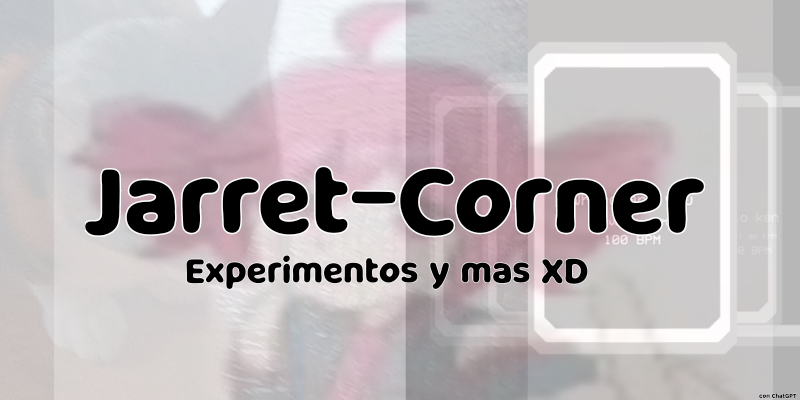

  

<h1> hola soy jarret </h1>
Aquí vas a encontrar proyectos básicos, pruebas y experimentos varios.

## Proyectos:
<table>
<tr>
<td width="50%" align="center">

### 🧩 Funkier pacher
Creador de cintas de sprites

</td>
<td width="50%" align="center">

### ⚙️ FNMM-Descompacter
Desarma niveles de Funky Maker: Mobile!, para optimizar sus imagenes

</td>
</tr>
</table>

## lenguaje usado:

  
  
  

## XD?

## Contacto:

